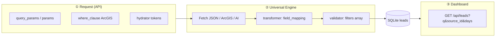

# How filtering works in Shiiman Leads

> **Audience:** Developers and power users who configure sources, debug scrapes, or extend the product.  
> **Companion docs:**  
> - **Step-by-step “what do I type where” (scenarios):** [ADD-SOURCE-REAL-WORLD.md](./ADD-SOURCE-REAL-WORLD.md)  
> - **Rule-by-rule JSON and operators:** [FILTERS-AND-LIMITS.md](./FILTERS-AND-LIMITS.md)

---

## TL;DR

| Layer | What it does filter?| When it runs?|
|--------|-----------------|--------------|
| **① API / request** | Fewer rows *returned* from ArcGIS or a JSON API (`where`, query params, dates) | When the HTTP request is built (before your code sees each row) |

| **② Universal Engine** | Which rows are *saved as leads* after fetch (rules on **mapped** field names) | After fetch, inside `runUniversalPipeline` — only if the engine is used for that source |

| **③ Dashboard** | What you *see* in the client portal (search, source, date range) | When you load `/api/leads` — **does not** change what was stored |

**Golden rule for layer ②:** Filter rules use **your** field names (from **Field mapping**), not the raw API keys.

---

## The big picture

Leads can be narrowed at three different stages. They are **independent**: you can use API constraints only, engine rules only, or both.

---

## ① API-side filtering (smaller responses)

**Goal:** Ask the remote system for less data (cheaper, faster, fewer rows to process).

### JSON / REST sources

- **`query_params` or `params`** — Passed to the HTTP client (see `backend/engine/adapters/rest.js`).
- **Dynamic dates** — Strings in params can include tokens that are replaced at scrape time (see `backend/engine/hydrator.js`):

  | Token | Meaning |
  |--------|---------|
  | `{{TODAY}}` | Today’s date (YYYY-MM-DD) |
  | `{{YESTERDAY}}` | Yesterday |
  | `{{DAYS_AGO_N}}` | e.g. `{{DAYS_AGO_30}}` → 30 days ago |
  | `{{DATE_30_DAYS_AGO}}` | Legacy alias for a 30-day window |

So “last 30 days” is often done **here** in the `where` or date fields the API expects — *before* the Universal Engine runs.

### ArcGIS sources

- **`where_clause`** — ArcGIS SQL-style expression (e.g. cost or date predicates). Applied in the ArcGIS adapter when building the request.
- Same idea: reduce rows **at the server**, not only in your validator.

**Important:** This layer does **not** use the `filters` JSON array. It only uses whatever the external API understands (`where`, query params, etc.).

---

## ② Universal Engine (which fetched rows become leads)

**Entry point:** `backend/engine/index.js` → `runUniversalPipeline(source)`.

**When does the engine run?**  
`legacyScraper.js` calls the engine only if `shouldUseEngine(source)` is true. That is roughly when the source has **any** of:

- `query_params` or `params` (JSON API)
- `where_clause` (ArcGIS)
- A non-empty `filters` array  
- (Optional nested `source.manifest` with the same kinds of fields)

See `shouldUseEngine` in `backend/engine/index.js` for the exact conditions.

### Pipeline (order matters)

1. **Fetch** — `restAdapter`, `arcgisAdapter`, or `aiVisionAdapter` returns raw records (arrays, `features`, etc.).
2. **Transform** — `backend/engine/transformer.js` renames keys using **`field_mapping`** (or `fieldSchema` legacy).  
   - If mapping is empty, the raw object is kept (plus `_raw` for debugging).
3. **Validate** — `backend/engine/validator.js` applies the **`filters`** array.  
   - Each rule: `{ "field", "operator", "value" }`.  
   - **Every** rule must pass (`Array.every`). If `filters` is empty or missing, **all** rows pass.

So: **mapping first, then rules.** Always reference **`field`** in rules as the **mapped** name (e.g. `budget`), not `EST_COST_AMT`.

### Operators

Implemented in `validator.js`:  
`>`, `<`, `>=`, `<=`, `==` / `equals`, `!=` / `not_equals`, `contains`, `in`, `between`, `days_ago`.  
Unknown operators default to **pass** (see `default: return true`).

Full tables and JSON examples: **[FILTERS-AND-LIMITS.md](./FILTERS-AND-LIMITS.md)**.

### Scraping paths that *don’t* use this pipeline

If `shouldUseEngine` is false, `legacyScraper.js` uses its older paths (ArcGIS hub flow, JSON fetch, Playwright, etc.). Those paths may still insert leads — but **without** applying the Universal Engine `filters` array.  
So if you rely on engine rules, ensure the source config actually triggers the engine (params / where / filters).

---

## ③ Dashboard filtering (viewing only)

**Endpoint:** `GET /api/leads` — `backend/routes/leads.js`.

| Query param | Effect |
|-------------|--------|
| `source_id` | Only leads from that source |
| `q` | `LIKE` search on `raw_data` (unified table) or text columns (legacy per-source tables) |
| `days` | Only leads with `created_at` in the last N days (when the column exists) |
| `limit` / `offset` | Pagination |

This affects **what the UI shows**, not what was ingested. Changing filters here does not re-run scrapes.

---

## UI fields on “My Sources” (what is *not* engine filtering)

In **`frontend/my-sources.html`**, sources can store:

- **Include keywords / Exclude keywords** — Saved on the source JSON for reference/display.
- **Universal Engine → Filters (JSON)** — This **is** the `filters` array the validator uses (when the engine runs).

**Current backend behavior:** `includeWords` / `excludeWords` are **not** applied automatically inside `legacyScraper.js` or the engine. To filter at ingestion, use **Filters (JSON)** and/or API `where` / query params.  
If you want keyword gating later, that would be a small feature: apply it after mapping, before `insertLeadIfNew`.

---

## Code map (quick reference)

| File | Role |
|------|------|
| `backend/engine/index.js` | `runUniversalPipeline`, `shouldUseEngine` |
| `backend/engine/validator.js` | Rule operators for `filters` |
| `backend/engine/transformer.js` | `field_mapping` → normalized lead |
| `backend/engine/hydrator.js` | Token replacement in `query_params` |
| `backend/engine/adapters/rest.js` | GET/POST JSON APIs |
| `backend/engine/adapters/arcgis.js` | ArcGIS fetch + `where` handling |
| `backend/legacyScraper.js` | Decides engine vs other pipelines; calls `scrapeForUser` |
| `backend/routes/leads.js` | Dashboard list + `q`, `source_id`, `days` |

---

## Troubleshooting

| Symptom | Things to check |
|---------|-----------------|
| No leads pass engine rules | Field names in `filters` must match **mapped** keys; missing fields often fail comparisons. |
| Engine never seems to run | Confirm `shouldUseEngine` — add `params`, `where_clause`, or non-empty `filters`. |
| “Last 30 days” wrong | Use hydrator tokens in **params** / `where`, and/or `days_ago` in **filters** on a real date field. |
| Rules work locally but not in prod | Same source JSON deployed? Restart server after `.env` / DB changes. |
| Keywords in UI don’t filter | Expected today — use **Filters JSON** or API-side filters until keyword logic is implemented. |

---

## See also

- **[FILTERS-AND-LIMITS.md](./FILTERS-AND-LIMITS.md)** — Operators, limits (`maxPages`, `testMode`), and copy-paste JSON.
- **[ENGINE-BLUEPRINT.md](./ENGINE-BLUEPRINT.md)** — Broader engine design.
- **[MASTER-GUIDE.md](./MASTER-GUIDE.md)** — End-to-end system overview.

---

*Last updated: 2026-03 — matches engine behavior in `backend/engine` and `legacyScraper.js`. If you change the pipeline, update this doc in the same PR.*
